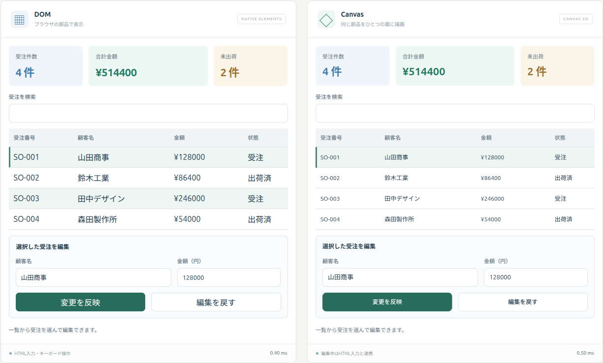
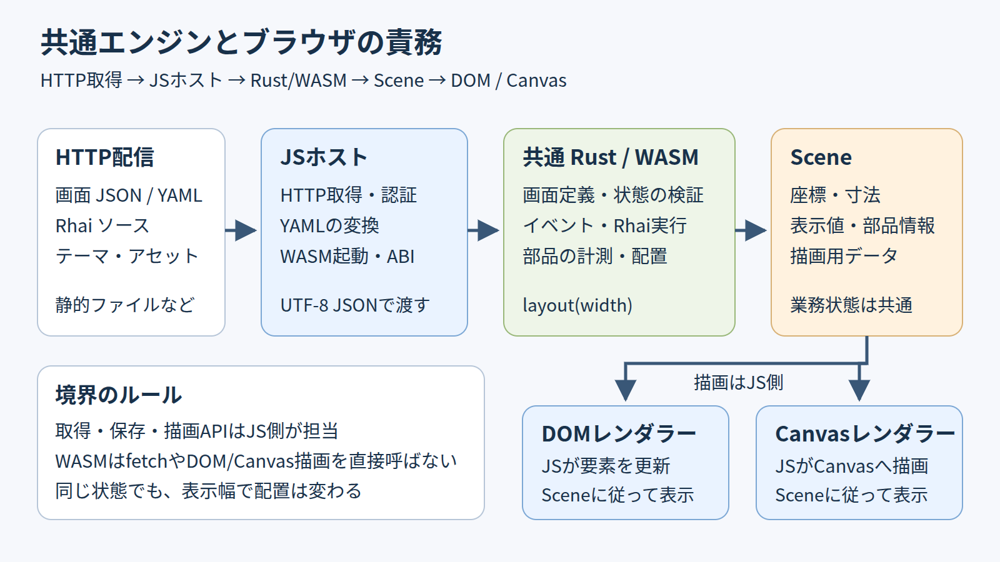
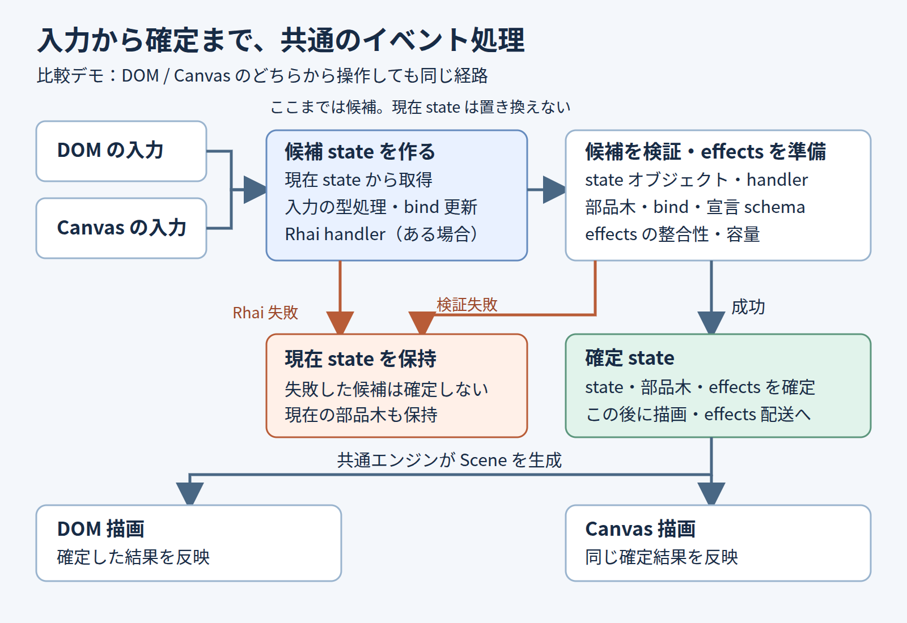
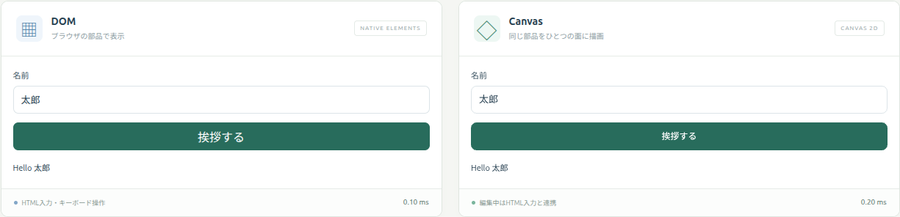
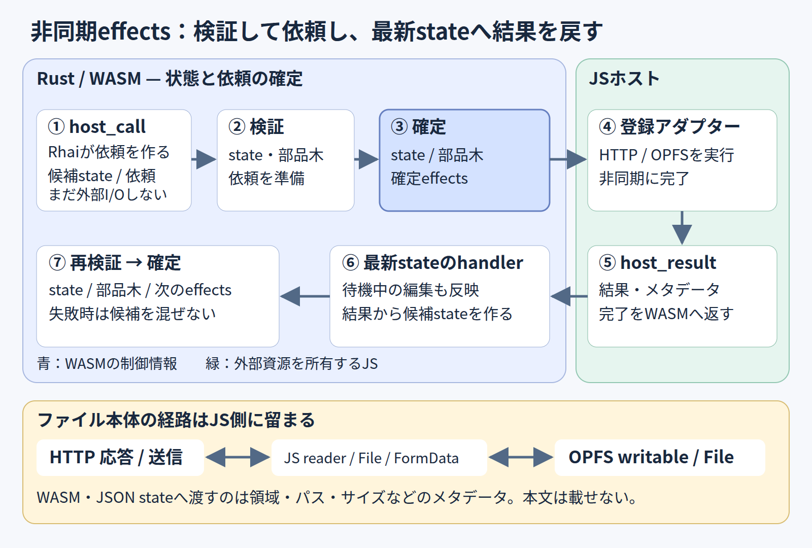
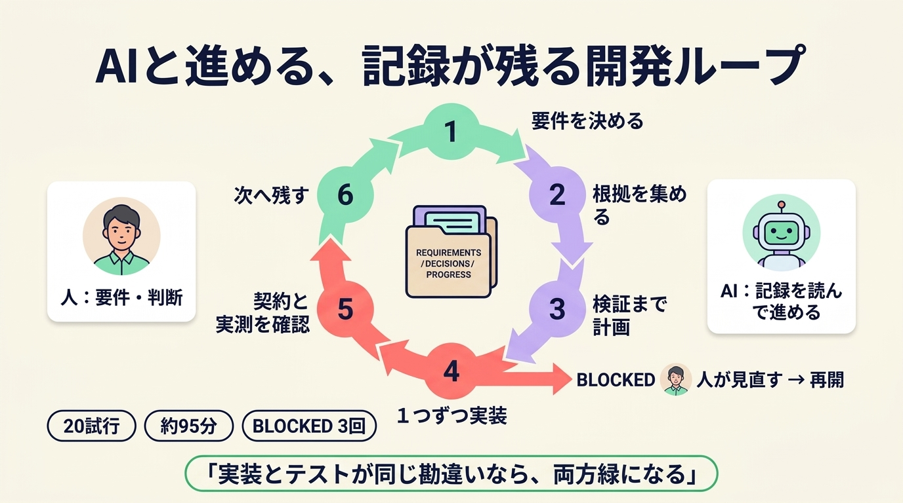

# 🧩 モックから「動く画面」へ！uivolveをRust/WASMで育ててみた

uivolve-webは、**JSONやYAMLで書いた画面定義を、そのままブラウザで動かすUIエンジンの試作**です。ボタンを押したときの処理はRhaiという小さなスクリプトで書き、Rust/WASMのエンジンが状態と配置を決めて、DOMとCanvasの両方へ表示します。

まずは触ってみてください。インストールは要りません。

**[公開デモを開く（受注管理）](https://6in.github.io/uivolve-web/pages/orders/)**



こちらは受注管理のサンプルです。左がDOM、右がCanvas。どちらで操作しても、もう片方に同じ結果が出ます。[受注管理を試す](https://6in.github.io/uivolve-web/pages/orders/)から開けますよ。各パネルの右下にある「0.40 ms」のような数字は、表示の更新にかかったCPU時間です。

この記事では、2026年10月2日から5日までの開発を振り返りながら、次の3つをお話しします。

- この形（Rust/WASM、二つの描画、Rhai）にすると、何がうれしいのか
- Hello Worldが動くとき、中で何が起きているのか
- AIに実装を任せてみて、どこで止まったのか

部品や機能の一覧は[README](https://github.com/6in/uivolve-web/blob/main/README.md)にまとめたので、ここでは仕組みと学びに絞ります。

## 🌱 出発点：uivolveは「モックを作って終わり」にしない

元になった[uivolve](https://github.com/6in/uivolve/blob/3d22a3cfab5488afe3c60f8775676a85c51593ec/README.md)は、React製の画面モックアップライブラリです。入力欄や一覧、ボタンを宣言的なDSLで書いて、画面の形をすばやく確かめます。

おもしろいのは、その先です。uivolveの狙いは、**作ったモックのDSLをAIへ渡して、好きなUIライブラリで本実装してもらうこと**。見た目を決める作業とコードを書く作業のあいだに、人もAIも読める画面定義を置くわけですね。Markdownの仕様書にDSLを埋め込めば、説明文のすぐ隣にモックを表示できます。

ただ、元のモックでは、ボタンの`handler`は名前を宣言するだけ。押しても処理は動きません。

「せっかく画面を定義したのだから、押したときの動きまで確かめたい」。uivolve-webは、ここから始まりました。画面定義にstate（画面の状態）とRhaiの処理を足して、入力、ボタン、通信、保存まで動かします。

引き継いだのは「画面の意図を宣言として残す」という考え方です。Reactの実装を移したものではなく、エンジンは一から組み直しました。DSLもuivolveやExtJSと完全互換ではなく、対応する部品は[移植対応表](https://github.com/6in/uivolve-web/blob/main/docs/uivolve-port.md)と[ギャラリーの契約](https://github.com/6in/uivolve-web/blob/main/docs/uivolve-gallery.md)にまとめています。

## 🦀 共通エンジン：画面の中身を一か所に集める

登場人物は3つ。どれも、開いたブラウザの中で動きます。

- **WASMエンジン**（Rust製）：状態を持ち、Rhaiを実行し、部品の配置を計算します
- **JSホスト**：エンジンの外側にいるJavaScriptです。ファイルの取得や通信、保存など、ブラウザのAPIを呼ぶ仕事を引き受けます
- **レンダラー**：DOM用とCanvas用の2種類。エンジンの計算結果を受け取って描きます



「挨拶する」ボタンを押すと、図の番号の順に進みます。

1. クリックをJSが受け取り、エンジンへイベントとして渡す
2. エンジンがRhaiのhandlerを実行して、stateを更新する
3. エンジンが配置を計算し、**Scene**を返す。Sceneは「どの部品を、どこに、どんな値で出すか」をまとめたデータです
4. レンダラーがSceneを見て、DOM要素やCanvasを更新する

つまり、**何を表示するかはWASMが決め、どう描くかはJSが受け持ちます。**

### この形だと、何がうれしい？

**画面の振る舞いを書く場所が一つになります。** 入力値の検証も、押せないボタンの判定も、エンジンの中だけ。DOM用とCanvas用に同じ処理を二度書かずに済みますし、あとで出てくるAIからの操作やテストも、同じ入口を通ります。

**DOMとCanvasを並べると、分担が守れているかすぐ分かります。** 片方のレンダラーだけに処理を書いてしまうと、もう片方では動きません。性格のまるで違う二つの描画先が、いわばお互いの検査役です。

**Rhaiは、Rustのプログラムに組み込めるスクリプト言語です。** エンジンがソースをASTへコンパイルして実行します。だから画面を増やすたびにRustをビルドし直す必要がありません。Rhaiから呼べるのは言語の標準機能とエンジンが用意した関数だけで、DOMやfetchを直接さわる手段を持たないのもポイントです。

正直にお伝えすると、「WASMだから速い」とは考えていません。JSとWASMのあいだはJSON文字列でやり取りするので、コピーと変換のコストがかかります。エンジン本体も、手元のビルドで約4.4 MiB（gzipで約1.2 MiB）。軽いとは言えないサイズです。

この試作で確かめているのは速さではなく、「画面定義・状態・描画をここまで分けても、ちゃんと動かせるか」です。細かな受け渡しの決まりは[アーキテクチャ](https://github.com/6in/uivolve-web/blob/main/docs/architecture.md)をご覧ください。

## 👋 Hello World：一つの定義で二つの画面を動かす

いちばん小さな例で、流れを追ってみましょう。名前を入力して挨拶する画面です。[画面のJSON](https://github.com/6in/uivolve-web/blob/main/public/screens/hello-world.json)から、部品の部分を抜粋します。

```json
[
  { "xtype": "textfield", "itemId": "nameInput", "bind": "name" },
  { "xtype": "button", "itemId": "helloButton", "text": "挨拶する", "handler": "sayHello" },
  { "xtype": "label", "itemId": "greetingLabel", "bind": "greeting" }
]
```

`bind`は、部品とstateをつなぐ指定です。入力欄はstateの`name`と、ラベルは`greeting`とつながっています。ボタンを押すと、`sayHello`が呼ばれます。その中身が、こちらの[Rhai](https://github.com/6in/uivolve-web/blob/main/public/screens/hello-world.rhai)です。

```rhai
fn sayHello(state, event) {
    let name = state.name;
    name.trim();
    if name == "" {
        name = "World";
    }
    state.greeting = "Hello " + name;
    state
}
```

「太郎」と入れて押せば「Hello 太郎」、空白だけなら「Hello World」。Rhaiの`name.trim();`は、変数そのものを書き換えて前後の空白を落とします。

注目してほしいのは、**このhandlerにDOMを探すコードも、Canvasへ文字を書くコードもない**ことです。stateを受け取って、新しいstateを返すだけ。表示へつなぐのは、エンジンとレンダラーの仕事です。



エンジンは、stateをいきなり書き換えません。まず現在のstateをコピーして「候補」を作り、入力とRhaiをそちらへ適用してから検証します。問題がなければ、候補を本物として確定。Rhaiがエラーを出したり検証に引っかかったりしたら候補を捨てるので、画面は元のまま残ります。新しい画面を読み込むときも同じで、壊れた定義のせいで表示中の画面を失うことはありません。

エンジンが一か所にまとまっていると、テストも楽になります。ブラウザを開かずに、本物のWASMへイベントを送って確かめられるんです。[既存のテスト](https://github.com/6in/uivolve-web/blob/main/tests/engine.test.js)からの抜粋です（エンジンの準備は省いています）。

```javascript
engine.load(screen, script);
engine.dispatch("nameInput", { value: "  太郎  " });
expect(engine.dispatch("helloButton").state.greeting).toBe("Hello 太郎");
expect(engine.layout(500).widgets.find((w) => w.key === "greetingLabel").text).toBe("Hello 太郎");
```

名前を入れて、ボタンを押して、stateとSceneの両方に「Hello 太郎」が入ったことを確認しています。実際の見た目は、ブラウザでも確かめました。



二つの画面は幅を別々に測って配置するので、文字の大きさや位置までぴったり同じにはなりません。そろえているのは「何を表示するか」のほうです。

冒頭の受注管理も、仕組みはまったく同じ。あの画面は、JSONが106行、Rhaiが69行です。件数や合計金額は、Rhaiの関数がstateの受注一覧から計算し直しています。

## 📬 通信と保存：画面の外の仕事もつなぐ

挨拶が動くと、次はデータを取りに行きたくなります。ここからの数日は、こんな順番で進みました。

| 日付    | 追加したもの                                                    |
| ------- | --------------------------------------------------------------- |
| 10/2    | それまでの試作をリポジトリへ取り込み、レイアウトとJWT認証を追加 |
| 10/3    | Hello World、HTTPでのJSON取得、型付きstateと保存、OPFS、RPC     |
| 10/4    | 単体で配布できるランタイム、HTTPアダプター、Workerモック        |
| 10/4〜5 | 大きなファイルの転送                                            |

困ったのは、Rhaiが同期実行だということ。通信が終わるまでその場で待つ、という書き方ができません。そこで、Rhaiは「これをお願い」と依頼を出すだけにしました。この依頼を**effects**と呼んでいます。



図の番号に、省かれている③④を補うとこうなります。

- ① Rhaiが`host_call`で依頼を準備する
- ② エンジンがstateを検証し、通ったときだけeffectsを確定する
- ③ JSホストがeffectsを受け取る
- ④ JSホストが通信や保存を実行する
- ⑤ 結果を`host_result`でエンジンへ戻し、Rhaiの完了handlerが最新のstateへ反映する

⑤で「最新の」と強調したのには理由があります。通信を待っているあいだに、ユーザーが別の欄へ入力しているかもしれません。依頼したときの古いstateへ結果を書き込むと、その入力が消えてしまいます。画面を切り替えたあとに届いた古い結果は、依頼の番号を照合して捨てています。

この分担がいちばん効いたのが、ファイル転送でした。ブラウザ内のファイル置き場であるOPFSへ、HTTPで受け取ったファイルを保存する機能です。100 MiBのファイルをWASMのメモリへコピーしたら、画面のstateとは関係のない重い荷物を抱えることになります。

そこで、ファイルの中身はJSホストが直接扱うことにしました。ダウンロードは届いた分から少しずつOPFSへ書き込み、アップロードはブラウザのFileをそのまま送ります。エンジンが知っているのは、保存先のパスやサイズ、進み具合といった「荷札」だけです。

「Rust/WASMを使うから、全部そこを通す」とはしませんでした。ブラウザが得意なことはブラウザに任せる。この方針のおかげで、100 MiBの転送も実ブラウザで通っています。中止や排他の細かな決まりは[OPFS転送の契約](https://github.com/6in/uivolve-web/blob/main/docs/opfs-file-transfer.md)にあります。

## 🤖 WebMCP：AIにも「このボタン」を伝えられる

元のuivolveは、画面の定義をAIへ渡すものでした。uivolve-webでは一歩進めて、**動いている画面をAIが操作する入口**を用意しています。それがWebMCPです。ブラウザ上のページが、AIエージェントへ「使える道具」を公開する仕組みですね。

比較デモは、起動時に5つの共通ツールを登録します。AIは画面の部品と状態を読み、「この部品へ、このイベントを」と名前で指定して操作できます。

これが特にうれしいのはCanvasです。Canvasの中身は、外から見るとただの絵。ふつうは画像から座標を推測して押すしかありませんが、ここでは部品を名指しできます。

しかも、AIの操作は人のクリックと同じ入口を通ります。エンジンの検証もRhaiのhandlerも共通なので、「AI経由だと検証をすり抜ける」ということが起きません。画面が切り替わったあとに届いた古い指示は、受け付けません。

使うには、WebMCPに対応したブラウザと、HTTPSかlocalhostでの配信が必要です。未対応のブラウザでも、通常のUIはそのまま動きます。設定は[WebMCP接続](https://github.com/6in/uivolve-web/blob/main/docs/webmcp.md)をどうぞ。

## 🧪 WorkerモックとUT：仮のサーバーも用意できます

一覧を取ったり注文を追加したりする画面を作りたい。でも、サーバーはまだない。そんなときのために、**Web Workerの中で動く仮のサーバー**を用意しました。初期データと受け付けるルートを、YAMLで書くだけです。

[注文モック](https://github.com/6in/uivolve-web/blob/main/public/mock/orders-api.yaml)を、一覧の取得だけに縮めた例がこちら。

```yaml
version: 1
collections:
  orders:
    key: id
    seed:
      - { id: O001, customer: 山田商店 }
      - { id: O002, customer: 佐藤工業 }
routes:
  listOrders: { method: GET, path: orders, operation: list, collection: orders }
```

実物のファイルには、登録、更新、削除、リセットのルートもあります。画面のRhaiは、通信のときと同じ`host_call`で依頼するだけ。あとで本物のサーバーができたら、接続先の設定を切り替えます。画面側を書き直さずに済むのが、いいところです。

できるのは、宣言した固定応答と、データの追加・取得・更新・削除まで。検索や遅延の再現、データの永続化には対応していません。それでも、バックエンドを待たずに画面のデータの流れを確かめられるのは助かります。

このモックも、Workerを起動せずにテストできます。[モックのテスト](https://github.com/6in/uivolve-web/blob/main/tests/worker-mock.test.js)からの抜粋です。`definition`は、上のYAMLを読み込んだ値です。

```javascript
const model = new MockApiModel(definition);
expect(model.request({ method: "GET", path: "orders" }).body).toHaveLength(2);
```

状態とロジックは先に小さなテストで固めて、実際のWorkerの読み込みや画面操作はブラウザで確かめる。役割を分けておくと、失敗したときに原因の場所を絞りやすくなります。構成は[WorkerモックAPI](https://github.com/6in/uivolve-web/blob/main/docs/worker-mock-api.md)で紹介しています。

## 📝 AI開発の振り返り：任せるための準備も大切でした

ファイル転送は、実装の大部分をAIに任せました。使ったのはgsd-liteという、開発を6つの工程に区切って進める手順です。区切りごとにAI（今回はCodex）を新しい会話で起動し、会話の記憶の代わりにファイルを読んで続きを進めます。



図の番号は、1がdiscuss、2がresearch、3がplan、4がimpl、5がverify、6がreflectです。真ん中のREQUIREMENTS、DECISIONS、PROGRESSが引き継ぎ用のファイル。要件と合格の基準は人が決めます。

researchからverifyまでは20回の起動で、動いていた時間の合計は約95分（5,697秒）でした。できあがったのは、計画13項目と、管理用を含む38コミット。ただし、人が対話した時間や止まって待っていた時間は入っていません。「95分で完成した」わけではないので、ご注意を。

実際、途中で3回止まりました。図のBLOCKEDです。

1. 最初のタスクで、実行環境がlocalhostでのサーバー起動を拒否しました
2. CSVを加工するサンプルで、Rhaiの`replace`が「値を返さず、変数を書き換える」ことに気づかず、やり直しの上限に到達しました
3. ブラウザ試験で、認証用のトークンが試験データのあいだで食い違っていました

どれも、人が環境や前提を直してから再開しています。記録上のリトライは0回でしたが、手戻りが0だったわけではありません。

いちばんの学びは、verifyで見つかりました。アップロードで既定のContent-Typeが送られていなかったのに、テストは全部成功していたんです。原因は、テストのほうも「付かない」を正解として書いていたこと。**実装とテストが同じ勘違いをすれば、両方そろって緑になります。**

気づけたのは、verifyが実装ではなく要件と突き合わせたからでした。期待する値は、要件から決める。次は計画の段階で、既定値の表を作っておきます。

## 🚧 制限と次の実験：まだまだ育てる余地があります

最後に、できていないことをまとめます。

- **Canvas版のアクセシビリティ**：部品ごとの読み上げ情報を持っていません。スクリーンリーダー、文字の選択、ページ内検索が必要な場面は、いまのところDOM版の担当です
- **日本語入力**：Canvas版も、編集中はブラウザの入力欄を重ねています。変換候補の位置やモバイルのキーボードは、実機での確認がこれからです
- **サイズ**：エンジンは約4.4 MiB。初回の読み込みを軽くする工夫は、まだしていません
- **Rhaiは同期実行**：タイマーや`async`は書けず、重い計算にも向きません
- **描画はCanvas 2D**：GPUを使う描画は検討の段階です

冒頭で触れた右下の数字は、DOMの更新やCanvasの描画命令にかかったCPU時間です。FPSやGPUの性能を比べた値ではないので、「どちらが速いか」の答えにはなりません。

小さなモックから始まって、入力、通信、保存、AIからの操作まで話が広がりました。宣言として残した画面の意図を、どこまで同じ材料で動かして確かめられるか。この実験は、もう少し先へ進めそうです。

よければ、[公開デモ](https://6in.github.io/uivolve-web/pages/hello-world/)で名前を入れて、挨拶ボタンを押してみてください。自分で画面を作ってみたくなったら、AI向けの[アプリ開発スキル](https://github.com/6in/uivolve-web/blob/main/skills/uivolve-web-app-dev/SKILL.md)が道案内をします（[使い方](https://github.com/6in/uivolve-web/blob/main/docs/skills.md)）。エンジンに手を入れたい方には[エンジン開発スキル](https://github.com/6in/uivolve-web/blob/main/skills/uivolve-web-engine-dev/SKILL.md)もありますよ 🚀

## 📚 参考リンク

- [元のuivolve：目的、AIへの引き渡し、Markdown/MDX統合](https://github.com/6in/uivolve/blob/3d22a3cfab5488afe3c60f8775676a85c51593ec/README.md)
- [uivolveの部品移植と対応範囲](https://github.com/6in/uivolve-web/blob/main/docs/uivolve-port.md)
- [設計と責務](https://github.com/6in/uivolve-web/blob/main/docs/architecture.md)
- [画面定義の契約](https://github.com/6in/uivolve-web/blob/main/docs/screen-format.md)
- [ホストHTTPアダプター](https://github.com/6in/uivolve-web/blob/main/docs/http-adapter.md)
- [OPFS転送と中止・確定の境界](https://github.com/6in/uivolve-web/blob/main/docs/opfs-file-transfer.md)
- [WebMCP接続](https://github.com/6in/uivolve-web/blob/main/docs/webmcp.md)
- [WorkerモックAPI](https://github.com/6in/uivolve-web/blob/main/docs/worker-mock-api.md)
- [テストの案内](https://github.com/6in/uivolve-web/blob/main/docs/testing.md)
- [OPFS開発の振り返り記録](https://github.com/6in/uivolve-web/blob/main/.gsd-lite/reflect/20261005-0843-opfs-file-transfer.md)
- [OPFS開発の進捗記録](https://github.com/6in/uivolve-web/blob/main/.gsd-lite/archive/opfs-file-transfer/PROGRESS.md)
