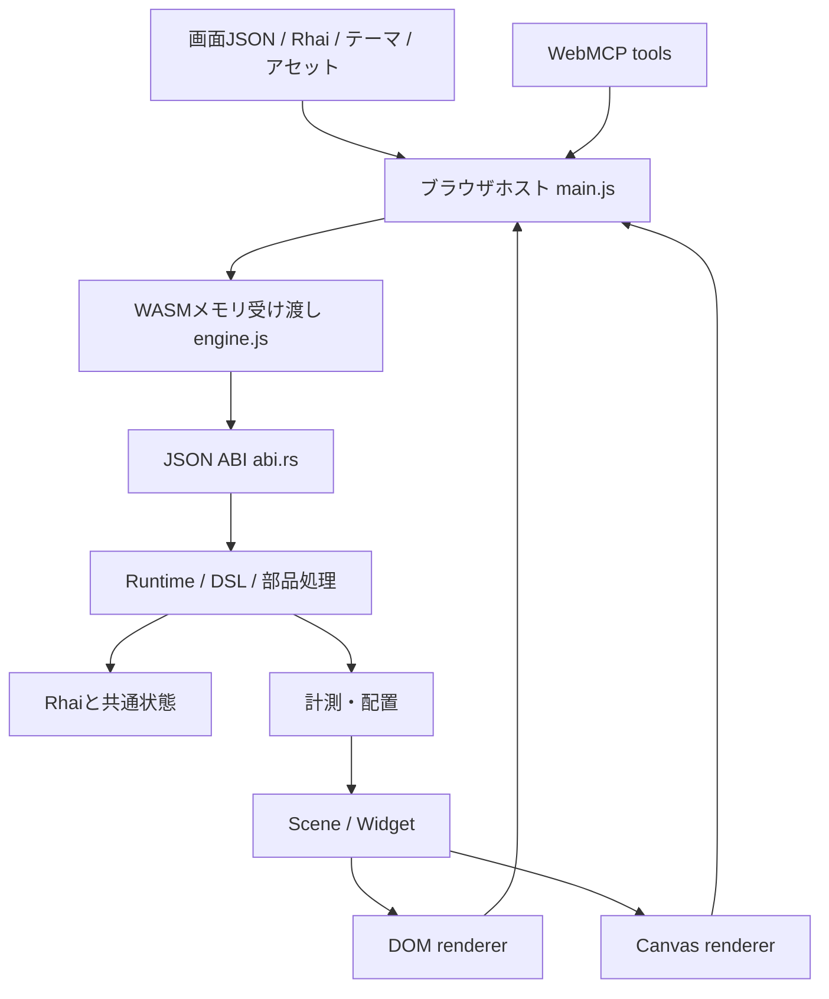

# アーキテクチャ

uivolve-webは、HTTPで配信する画面パッケージと、ブラウザ内のUIエンジンを分ける。必要なサーバーは静的ファイルのHTTP配信。現在のデモに業務APIや保存サービスはない。

## 責務

| 場所                                         | 担当                                                                                                  |
| -------------------------------------------- | ----------------------------------------------------------------------------------------------------- |
| `engine/src/lib.rs`                          | Package/Node/Widget/Scene、Runtime、共通検証、イベントの確定、基本部品の計測・配置、windowの重ね表示  |
| `engine/src/abi.rs`                          | UTF-8 JSONの操作振り分け、WASMインスタンス内のRuntime・応答バッファ、公開メモリ関数                   |
| `engine/src/theme.rs`                        | テーマの検証・色トークンの解決・現在テーマ。画面切替後も同じWASMインスタンス内で保持                  |
| `engine/src/fields.rs`                       | xtype別名・入力の初期値、型・範囲・選択肢検証、入力Widget設定                                         |
| `engine/src/layouts.rs`                      | 共通レイアウトの設定・Card状態・必要高・配置スロット                                                  |
| `engine/src/grid.rs`                         | Data Gridの列・行・選択・ソート・検索・ページ・編集下書き                                             |
| `engine/src/navigation.rs`                   | タブ・ツリー・メニューの状態と表示・操作                                                              |
| `engine/src/extras.rs` / `figures.rs`        | 追加部品・構成の展開、文書・図表の描画データ生成                                                      |
| `src/main.js`                                | HTTP取得、URL・メディアの事前確認、カレンダーの日付補完、画面エディタ、テーマ切替、再描画、ホスト状態 |
| `src/resource-client.js`                     | 共通HTTP/CORS取得、認証なし・Bearer JWT、送信先・リダイレクト・取得失敗の扱い                         |
| `src/engine.js`                              | JSON/UTF-8の入出力。業務処理やスクリプトのevalは行わない                                              |
| `src/widget-contract.js`                     | フィールド・ボタン分類、物理操作と意味的操作、WebMCPの許可actionと操作ブロック判定                    |
| `src/screen-catalog.js`                      | 同梱画面のidとtitle。WebMCPからも利用する                                                             |
| `src/dom-renderer.js` / `canvas-renderer.js` | Widgetの描画、フォーカス、入力・ポインターのイベント変換                                              |
| `src/field-control.js`                       | 両描画方式のネイティブ入力、型付き値、IMEイベント、入力要素の更新                                     |
| `src/surfaces.js`                            | 図表・文書の共通描画データ、SVG/Canvas描画、画像・動画・iframeのライフサイクル                        |
| `src/webmcp.js`                              | 意味的なUIツール、可視性・token/revision確認、対応ブラウザへの登録・解除                              |

## 画面とイベントの確定

`load`はJSONを解析・正規化・構造検証し、既定状態を補完してからRhaiをコンパイルする。参照されたhandlerの存在を確認し、`init(state)`の結果、部品固有の状態制約、状態サイズを確認する。成功したRuntimeだけをABIのスロットへ入れる。以前の画面は候補が失敗しても残る。

イベントは対象までのパスを探し、disabled、非表示のタブ/Card/window、折りたたみ、モーダル背後などを共通エンジンで判定する。対象外なら状態・revisionを更新しない。受け付けたイベントは状態のコピーへ組み込みの変更を適用してからRhaiを実行する。結果をオブジェクトへ戻し、Grid・ナビゲーション・追加部品・Cardの状態制約とサイズを確認してから確定し、revisionを進める。

この順序により、入力の`bind`更新やwindowの開閉も、Rhaiが失敗すれば確定しない。入力値の型検証と、任意のRhaiによる全状態の検証は同一ではない。たとえば必須入力などの業務制約はRhaiに置く。具体的な値・actionの契約は[画面形式](screen-format.md)と部品別の文書を参照する。

JavaScriptの`compile`は、WASMのload成功後に両レンダラーをリセットし、画面tokenを発行する。tokenは同じ画面を再取得した場合も変わる。Rhaiの状態オブジェクトはDOMやCanvasを参照しない。

## 配置と描画

`layout(width)`は状態を変更せずにSceneを生成する。幅は240..4096。DOMとCanvasの表示エリアは別々の幅で計測するので、同じ状態でも座標が異なる場合がある。Rustは部品の必要高と子の配置を計算し、JavaScriptは座標に従って表示する。

Sceneは`theme / width / height / widgets / modal / popup`。Widgetは`key / target / kind / x / y / width / height / layer / text / value / variant / disabled / selected / cells / fractions / payload / config`を持つ。`target`はイベント送信先、`key`は描画要素の同一性。複合部品は同じtargetへ異なるkey/payloadで操作を送る。`config`は入力・図表・メディアなど部品固有の描画情報で、DSLへそのまま記述する設定ではない。

DOMはkeyを使って既存要素を更新し、Canvasは面全体を再描画する。Canvasの入力時はネイティブinput/textarea/selectを重ねる。変換中の要素は再描画・テーマ変更で作り直さず、composition中は状態への文字入力を送らない。

`widget-contract.js`の物理操作分類はCanvasのフォーカス・ヒット判定とDOMのボタン作成に使う。読み取り専用の入力にはフォーカスできるが、WebMCPの変更操作はブロックする。Cardは意味的な切替actionを持つ一方、自動の物理ボタンにはならない。この違いを維持する。

## ABI

公開する関数は`input_alloc(len)`、`input_free(ptr,len)`、`request(ptr,len)`、`response_len()`。JSは入力を確保してUTF-8 JSONを書き込み、requestが返す応答のポインターと長さを読む。入力はfinallyで解放する。応答はエンジン所有で、次のrequestまで有効。次の呼び出しより前にJSONへ読み取る。メモリが拡張され得るため、呼び出し後はその時点の`memory.buffer`を使う。

操作は`load / event / layout / theme`。成功は`{ "ok": true, "data": ... }`、失敗は`{ "ok": false, "error": "..." }`。入力の上限は2,000,000バイト。現在のWASMはブラウザのimportを要求しない。HTTP取得と描画APIはホストが担当する。各操作の詳細は[画面形式](screen-format.md)、[レイアウト](layouts.md)、[テーマ](theme-format.md)を参照する。

Rustのcrate名`wasm-ui-engine`と同梱の画面作成スキル名`wasm-ui-authoring`は既存の識別子として保持している。製品名はuivolve-web。

HTTP認証はホストのResourceClientへ置く。画面・Rhai・テーマは同じ設定で取得し、必要ならWASMファイルの起動取得にも利用できる。JWTはWASMのリクエスト・共通state・Sceneへ入れない。CORSを既定で使用し、JWTの送信先・失敗・配信側の設定は[JWT・CORS契約](authentication.md)に定める。

任意のリフレッシュ設定は`token-session.js`が両トークン・有効秒数・ローテーションを保持し、同時要求の更新を共有する。ResourceClientは401時の1回の再試行を担当する。`http-policy.js`は両取得経路のURLとBearer形式の検証を共有する。

## 境界と今後

WebMCPも人の入力と同じWASMイベントを実行する。ツールの登録機構とUI処理は独立し、WebMCP未対応でも通常UIは動く。ツールの変更要求はscreen token・revision・可視性を検査するが、クライアント内のUI検証はサーバーの認可を代替しない。

Rhaiは同期実行で、操作数などの制限を持つ。非同期通信・外部サービス・タイマー・GPU描画・永続化は現在の契約にない。これらの追加時はホストとエンジンの責務を先に設計する。現段階の制限は[README](../README.md)と部品別の契約に記載する。
