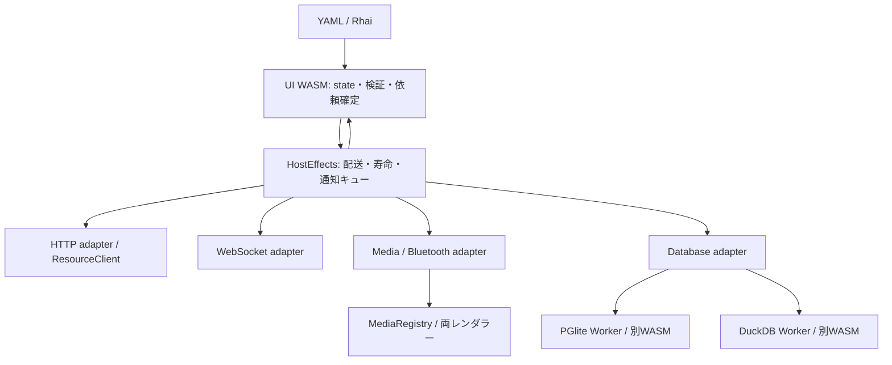

# ブラウザホスト・アダプター設計

設計日: 2026-10-04。状態: 将来設計と設計履歴。host_call、HostEffects、HTTPアダプターは初期版を実装済みで、使用するAPI・DSLは[現行HTTP契約](http-adapter.md)を優先する。この文書の残りのアダプターと継続通知、バッファ送信は未実装。既存GET、storage、file、RPCも維持している。

| 範囲                                                         | 状態                                                               | コード生成の根拠                     |
| ------------------------------------------------------------ | ------------------------------------------------------------------ | ------------------------------------ |
| host_call / host_result / HTTP                               | 実装済み。optionsにメソッド等を置く。JSON本文、json/text/empty応答 | [現行HTTP契約](http-adapter.md)      |
| WebWorkerの固定応答・CRUD                                    | 実装済み。独立モックDSLとworkerMockAdapter                         | [現行Worker契約](worker-mock-api.md) |
| host_event / host_close / WebSocket / Media / Bluetooth / DB | 将来案。本文の例を実装済みAPIとして使わない                        | 実装する際の検討資料                 |

## 目的と境界

YAML/JSONとRhaiだけでHTTP、WebSocket、カメラ・マイク、Bluetooth、ブラウザ内SQLを利用できるようにする。既存の`UiRuntime`を拡張し、比較デモと独立アプリで同じアダプターを使う。専用IDEは必要としない。



UIのWASMから別のWASMへ直接リンクしない。JavaScriptが各SDK、Worker、接続、MediaStream、Arrowを所有し、UIのWASMにはJSONと既存バッファABIだけを渡す。Rhaiは同期のまま、依頼・完了handler方式を維持する。

## 構成

| 提案ファイル                              | 責務                                                                 |
| ----------------------------------------- | -------------------------------------------------------------------- |
| `engine/src/host.rs`                      | Rhai API登録、宣言検証、依頼キュー、pending/subscription、通知の確定 |
| `src/host-effects.js`                     | アダプター登録、配送、世代、順序、上限、単発と継続通知               |
| `src/host-resources.js`                   | app単位の接続・識別子・所有権・解放                                  |
| `src/adapters/http.js`                    | ResourceClientを使う汎用HTTP                                         |
| `src/adapters/websocket.js`               | 接続・送受信・切断                                                   |
| `src/adapters/media.js` / `bluetooth.js`  | デバイス操作、許可、解放                                             |
| `src/adapters/database.js`                | SQL操作の共通契約とドライバー選択                                    |
| `src/adapters/db/pglite.js` / `duckdb.js` | SDKとWorkerの差異の吸収                                              |
| `src/media-registry.js`                   | ライブ映像の参照・表示・スナップショット                             |

当初は新機能だけをHostEffectsへ配送する。`kind`省略のGET、storage/file/rpc/dialog/navigateと既存ABIは維持する。既存実装の統合は同じ振る舞いを確認できた機能から行う。

## 宣言とホスト登録

ホストの起動コードは信頼するコードとしてアダプターと接続先を登録する。画面定義が任意のJavaScriptやSDKをimportすることは認めない。DB等の重い依存は使用時に遅延ロードし、利用しないアプリの配布物へ含めない。

起動設定の提案例:

ホスト登録の以下のコードは将来構成の例。HTTPだけの実行可能な構成は[現行契約](http-adapter.md)を使う。

```js
const runtime = await createRuntime({
  element: document.querySelector("#app"),
  adapters: [
    httpAdapter(),
    websocketAdapter(),
    mediaAdapter(),
    bluetoothAdapter(),
    databaseAdapter(),
  ],
  connections: {
    api: { adapter: "http", baseUrl: "https://api.example.com/" },
    updates: { adapter: "websocket", url: "wss://api.example.com/events" },
    camera: { adapter: "media", video: true, audio: false },
    sensor: { adapter: "bluetooth", services: ["battery_service"] },
    local: { adapter: "database", driver: "pglite", storage: "indexeddb" },
    analytics: { adapter: "database", driver: "duckdb", storage: "memory" },
  },
});
```

`connections`はapp.jsonにも宣言可能だが、アダプター実装・認証取得関数・許可上限は起動コードが決める。SQL、固定URLのパス、handler等は画面の`operations`へ宣言する。app接続を画面が参照する際は、ホストの許可操作と画面宣言の両方を照合する。

```yaml
operations:
  listOrders:
    connection: local
    action: db.query
    sql: SELECT id, customer FROM orders WHERE status = $1 ORDER BY id LIMIT 100
    handler: ordersLoaded
  saveOrder:
    connection: api
    action: http.request
    handler: orderSaved
    options:
      method: PATCH
      path: orders/{id}
      response: json
  connectUpdates:
    connection: updates
    action: ws.connect
    handler: connected
    events:
      message: updateReceived
      close: updatesClosed
      error: updatesFailed
```

パス変数はセグメントとしてエンコードし、queryはURLSearchParamsで構築する。SQL値の文字列置換をしない。DBのプレースホルダーはドライバーのSQL方言に従う。

## RhaiとABI

共通APIは`host_call(operation, arguments)`。通信やDBはこの窓口を使う。将来の`db_query`等の糖衣APIも同じキューへ変換し、別の確定処理を作らない。

```rust
fn loadOrders(s, e) {
    s.loading = true;
    host_call("listOrders", #{ params: ["open"] });
    s
}
fn ordersLoaded(s, r) {
    s.loading = false;
    if r.ok { s.orders = r.data.rows; }
    else { s.error = r.error.message; }
    s
}
```

effectの提案形:

```json
{ "kind": "host", "v": 1, "id": 42, "operation": "listOrders", "args": { "params": ["open"] } }
```

ホストはWASMから来たoperationを確定済み宣言へ照合する。結果のABIは`host_result`、継続通知は`host_event`。配送時にホストがscreenTokenとengine世代を保持し、完了時に照合する。WASMもpending id、操作、handle、イベント種別を検証する。起動時に対応プロトコルと機能を照合し、必要機能がない画面は置換前に失敗させる。

単発の成功は`{ok:true,data:...,error:null}`、失敗は`{ok:false,data:null,error:{code,message,retryable,outcome}}`。error.codeは`UNSUPPORTED / PERMISSION_DENIED / USER_GESTURE_REQUIRED / INVALID_ARGUMENT / TIMEOUT / CANCELLED / NETWORK / CLOSED / LIMIT / DATABASE`を基準にする。元の例外や認証情報は直接公開しない。

`outcome`は`not-started / failed / committed / unknown`。完了結果とUI handlerの失敗を区別する。HTTP更新やDB commit後にRhaiが失敗しても、外部の変更は巻き戻らない。ホストの診断には外部処理の結果とhandler失敗を別に残し、更新操作を自動再送しない。

## 確定・順序・寿命

1. Rhaiは依頼を一時キューへ積む。
2. state/UI、operation、引数、件数、バッファ容量をすべて検証する。
3. 成功時だけstateとeffectsを確定し、ホストが外部処理を開始する。
4. ホストは通知を直列キューへ入れ、最新stateでhandlerを実行する。Rhai実行中にWASMへ再入しない。
5. handlerのstate検証成功後にrevisionを進め、両レンダラーへ反映する。

単発のterminal結果は一度だけ消費する。結果handlerが失敗した場合はpendingを解放し、診断に残す。自動で同じhandler・外部処理を再実行しない。継続通知はhandleごとの単調なseqを持ち、重複・逆順を破棄する。イベントhandler失敗時はそのsubscriptionを停止し、UIから明示的に再購読する。

接続の寿命と購読の寿命を分ける。DB接続は標準app寿命、WebSocketは標準screen寿命でapp寿命も選択可。カメラ・Bluetoothは初期版ではscreen寿命。購読・cursor・pending handlerはすべてscreen寿命とする。

画面置換成功時に旧pending/購読を無効化し、screen接続を解放する。候補画面のコンパイル失敗時は旧画面・接続を維持する。app接続は新画面で新規購読するまでイベントを届けない。dispose時は全接続・Worker・映像track・listener・cursorを解放する。再コンパイルも画面置換として扱う。

AbortSignalは中止の要求であり、処理の巻き戻し保証ではない。実行済みHTTP更新、DB commit、Bluetooth書き込みは残り得る。タイムアウトしても実処理が走るDBは、停止・完了確認まで次の処理を開始しない。Worker強制終了は最終手段で、接続をfaultedにし、復旧と永続データ確認を経て再開する。

## アダプター契約と上限

JavaScriptの提案インターフェース:

```ts
interface HostAdapter {
  describe(): AdapterCapabilities;
  execute(
    operation: ResolvedOperation,
    args: JsonValue,
    context: {
      signal: AbortSignal;
      screenToken: string;
      resources: HostResourceRegistry;
      emit(event: HostEvent): Promise<void>;
      buffers: HostBufferBridge;
      activation: ActivationContext | null;
    },
  ): Promise<HostResult>;
  releaseScreen(screenToken: string): Promise<void>;
  dispose(): Promise<void>;
}
```

`describe`は対応action、永続化方式、キャンセル、ユーザー操作要否、利用可能性を返す。接続の所有者・実体はHostResourceRegistryに置き、handleはapp/画面/adapterへ紐付く不透明な文字列とする。handle文字列の照合だけでアクセスを許可しない。

初期上限は画面の新規pending 8、subscription 8、受信待ち32通知、JSON結果1 MB。既存ABIの2 MB入力上限・state上限も別に適用する。ホストは引き下げ可能。外部バイナリは既存buffer ABIへサイズ確認後にコピーし、WASMバッファidとホストhandleを混同しない。

WebSocket/BLEはキュー満杯で黙ってデータを捨てず、subscriptionをLIMITで停止する。メディアpreviewは最新フレームのみ表示し、毎フレームRhaiへ渡さない。DBはページ取得を明示的に要求する。ホストのemitは受領待ちを提供するが、WebSocketの送信元に対するbackpressure保証にはならない。

## HTTP（当初案・現行との差）

以下は当初案。現行版はJSON要求本文とjson/text/empty応答を提供し、bytes・バッファ本文は未実装。実行コードは[現行HTTP契約](http-adapter.md)から生成する。

GET/POST/PUT/PATCH/DELETE/HEADを提供。JSON、text、bytes、空応答を明示する。204/HEADはbodyなしで成功。応答にstatusと許可したheadersを含める。非2xxはHTTP statusを持つ失敗として返す。bodyはJSON/text/既存バッファを初期対応とし、multipartは後続とする。

既存ResourceClientのURL・CORS・送信先・認証ポリシーを共有する。JWTはstate/DSLへ渡さず、Authorizationはホストが設定する。任意headersはホスト許可リスト内に制限。GETの従来契約は維持する。更新メソッドは401更新を含む自動再送を標準OFFにし、サーバーが保証するidempotency key等を宣言した場合だけ許可する。

## WebSocket

`ws.connect / send / close / subscribe / unsubscribe`。connectはhandleを返し、message/error/closeを購読する。接続時の購読登録をopen通知より先に確定し、初期messageを取りこぼさない。text/JSON/bytesに対応し、送信前にbufferedAmountと上限を確認する。

初期版は自動再接続・送信再実行なし。追加時は再接続状態、指数backoff、明示的な再購読を設計する。ブラウザWebSocketへ任意Authorization headerを付けるAPIはない。認証はサーバー契約に応じてCookie、短寿命接続ticket、接続後メッセージ等をホストで扱い、HTTP JWT設定をそのまま流用したと見なさない。

## カメラ・マイクとBluetooth

Mediaは`media.open / stop / snapshot`。openはstream handleとtrack情報を返す。新しいライブメディア部品がhandleを参照し、DOMはvideo.srcObject、Canvasはホストvideoのフレームを描く。両表示で取得を二重実行しない。snapshotは画像バッファを返す。マイク録音・音声解析は後続actionとして分離する。

Bluetooth初期対象はBLE GATTの`ble.request / connect / read / write / subscribe / unsubscribe / disconnect`。許可service/characteristicはホストに宣言し、接続状態・値更新を通知する。任意のBluetoothプロファイルへの対応は約束しない。

ユーザー操作が必要なAPIは、実際の信頼されたクリック/キーイベントを起点に、同期Rhai検証後、同じ呼び出しスタックで開始する。事前にアダプターをロードしておき、権限要求より前にawaitやWorker待ちを挟まない。activationはホストだけが保持し、Rhai引数で偽造できない。init、HTTP完了、WebMCP、自動操作は有効な操作起点を持つと仮定せず、条件を満たさなければUSER_GESTURE_REQUIREDを返す。

HTTPS等の安全なコンテキスト、iframeのPermissions-Policy、API/OSの対応を起動時に確認する。利用不可は理由付きcapabilityとして表示できるようにする。許可拒否と機能非対応を区別する。

## SQLデータベース

「PostgreSQLのWASM」は初期ドライバーとしてPGliteを採用する設計。別のPostgreSQL系WASMもdriver契約を実装して追加可能。これはブラウザ内DBであり、外部PostgreSQLサーバーへの直接接続ではない。外部DBはHTTP/RPCのサーバー側APIを介する。

| 項目         | PGlite                   | DuckDB-WASM               |
| ------------ | ------------------------ | ------------------------- |
| 主な用途     | ローカル業務データ、更新 | 集計、分析、ファイル検索  |
| 実行         | 専用WorkerでSDKを保持    | SDKの非同期Worker         |
| 初期保存     | memory / IndexedDB       | memory、対応確認後にOPFS  |
| パラメーター | `$1`等                   | prepared statementの`?`等 |
| 内部結果     | rows / fields            | Arrowをホストで正規化     |

共通actionは`db.open / query / execute / transaction / fetch / cursorClose / close`。通常は初回操作でlazy openし、移行完了までreadyにしない。queryは固定SQL＋params、executeは固定の単一更新文、transactionは名前付き操作と引数の配列を1依頼で渡す。Rhai handlerをまたぐBEGIN/COMMITは初期版では提供しない。

transactionは同じ専用接続で一括実行し、途中失敗はrollback。PGliteではSDKのtransaction、DuckDBでは専用connectionのBEGIN/COMMIT/ROLLBACKをdriver内で使う。同じconnection上の別操作を途中へ割り込ませない。commit確認後だけ成功を返し、複数DB・HTTP・UIをまとめた原子性は保証しない。

DBの共通結果は`{columns:[{name,type,nativeType}],rows:[{...}],affectedRows:null,cursor:null}`。重複列名は初期版ではエラーとしSQLのASを要求する。affectedRowsが確実に取れないdriverはnullを返す。SQL方言、型、拡張の互換性までは共通化しない。

JSON変換規則: null/bool/string、安全な整数と有限浮動小数はJSON値。64bit整数・DECIMALは精度保持の文字列、日付/時刻は明示形式の文字列、binaryはbuffer参照。columnsのtypeで区別する。非有限floatは型付き表現を使い、JSON化時にnullへ黙って置換しない。paramsもcolumnsとは別の型付き値指定を持ち、文字列を暗黙にBigIntへ変換しない。

初期queryはSQLのLIMITによる小さな結果取得を推奨し、上限超過はLIMITとして失敗する。ホスト側で結果を切るだけではDBの全件materializeを防げない。streaming capabilityのあるdriverだけcursor/fetchを提供し、batch単位に上限を適用する。PGliteで同じstreamingが使えると仮定せず、アプリ側のkeyset paginationを使えるようにする。大きなArrowは初期版ではstateへ渡さず、将来のデータセット参照APIへ分離する。

schemaVersionと固定migration列はapp設定に置く。Worker内でDB単位に直列実行し、migration失敗時は操作を開始しない。永続データはapp id / DB名で分離し、画面切替では消さない。複数タブは初期版ではWeb Locksによる単独所有とし、利用不可環境の永続モードはUNSUPPORTEDを返す。後続でPGliteのmulti-tab Worker等を選択できるようにする。

DuckDBのファイル/拡張/外部URL参照はHTTPアダプターを経由しない場合がある。画面からの任意SQL実行は初期版では公開せず、信頼するアプリ作者の固定SQLと許可assetを使う。設定されたSQLとDB拡張もホストポリシーに含める。プレースホルダーだけでファイル・ネットワークアクセスを制限できるとは見なさない。

## 配布と検証

DBのJS/Worker/WASM/補助ファイルは同じビルドでバージョン固定して配布する。CSP、Worker URL、MIME、OPFS対応を確認する。DuckDBのスレッド利用はcross-origin isolationを必要とする選択構成とし、単一スレッド版を基準にする。ライブラリ更新時に永続形式・migration・型変換の互換性を再検証する。

検証では、Rhai拒否時に外部処理が始まらないこと、候補画面失敗時の旧接続維持、遅延/重複通知、満杯キュー、dispose後の通知、更新結果とhandler失敗の区別を実WASMで確認する。権限とactivationは実ブラウザで確認し、WebMCP経由で迂回できないことを確認する。

DBは両driverでparams、精度、null、重複列名、rollback、並行依頼、タイムアウト、永続化再起動、複数タブ排他を確認する。Workerの終了・バッファ解放と、DOM/Canvasで接続が二重にならないことも確認する。

## 実装順序

1. HostEffects・宣言・Rhai・ABIと偽アダプターによる共通契約。
2. HTTPメソッド追加と既存GETの互換確認。
3. Database契約とPGlite、続いてDuckDB-WASM。各driverを独立配布可能にする。
4. WebSocketの継続通知と寿命管理。
5. MediaRegistryとカメラ表示、Bluetoothのactivation対応。
6. 実装済み機能だけを契約文書・サンプル・両開発スキルへ反映する。

## 参照

公式資料を2026-10-04に確認。SDKの具体的バージョンは実装開始時に固定する。

- [既存アーキテクチャ](architecture.md)、[最小ランタイム](runtime-distribution.md)、[バッファABI](files-cache-rpc.md)。
- [PGlite API](https://pglite.dev/docs/api): query、params、transaction、保存先、型変換。
- [PGlite multi-tab Worker](https://pglite.dev/docs/multi-tab-worker): タブ間共有。
- [DuckDB-WASM query](https://duckdb.org/docs/current/clients/wasm/query): prepared statement、Arrow、streaming。
- [DuckDB-WASM instantiation](https://duckdb.org/docs/current/clients/wasm/instantiation): Worker、OPFS、スレッド構成。
- [カメラ・マイク](https://developer.mozilla.org/en-US/docs/Web/API/MediaDevices/getUserMedia)、[Bluetoothのデバイス選択](https://developer.mozilla.org/en-US/docs/Web/API/Bluetooth/requestDevice)。
